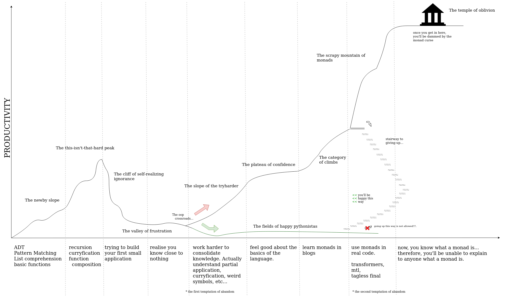
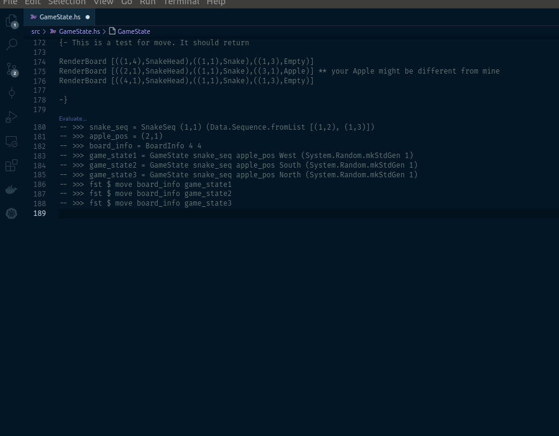

# snake-fury

- [snake-fury](#snake-fury)
  - [Introduction](#introduction)
    - [note about not using monads](#note-about-not-using-monads)
  - [Start coding. Building a MVP](#start-coding-building-a-mvp)
    - [On using vscode](#on-using-vscode)
  - [Refactors](#refactors)
  - [Solution branches](#solution-branches)
  - [Building and Running](#building-and-running)
  - [Arquitecture](#arquitecture)
  - [Set up a development environment](#set-up-a-development-environment)
  - [Contributions](#contributions)

[](https://gitpod.io/#https://github.com/lsmor/snake-fury)

## Introduction

**Welcome to snake-fury**: the Haskell challenge for beginners. This challenge aims to provide a learning path for people willing to learn Haskell further than basic recursion exercises by implementing the snake game in Haskell. Snake-fury's pedagogical approach is based on two legs:

- snake-fury isn't a tutorial but a challenge.
- snake-fury is focused on learning by refactoring, not by example.

The first leg means that you'll be asked to implement some functions/algorithms. It is expected that the challenger will be unable to implement them without some research on Hackage's documentation, blogs, youtube videos, etc. There will be guidelines to help the challenger. Nevertheless, an important skill when learning Haskell is to be able to search, read and understand the documentation that is (often, but not always) more complex and less accessible than other programming languages.

The second leg is even more interesting. Haskell is notoriously known for its difficulty and the popularization of the holy triad: Functor - Applicative - Monad. There are plenty of tutorials showing examples and hundreds of thousands of lines trying to make them accessible and newcomer-friendly... But with all due respect, It seems they all fail to explain: "Why monads? Why not other less mathematical abstraction? Why not classic OOP patterns?". The approach given by snake-fury is to make the same application twice... it sounds crazy, but the idea goes like this: You'll implement a "pure" version of the snake game: No monads, no functors, no abstractions [[see below](#markdown-header-note-about-not-using-monads)]. Then you will refactor the core application logic using the state and reader monads. Then you'll be asked to abstract your code and to use `mtl` classes to make your code less dependent on the concrete implementation.

Below there is a dramatization of Haskell's learning curve. This challenge aims to be a helpful companion from the newby slope to the temple of oblivion... but be aware, nothing will save you from the temptation of abandon. Hopefully, you'll be able to climb up to the temple and spread the lambdas  



### note about not using monads

> By that I mean, not using do notation nor functor/applicative/monads combinators like `liftA2`, `fmap`, `>>=`, etc...
> Obviously, The IO and the asynchronous part of the code are provided and the challenger is not expected to solve it.

## Start coding. Building a MVP

Be sure you have a haskell developement environment [up and running](#markdown-hearder-set-up-a-development-environment). If you don't want to install Haskell's toolchain yourself, you can use gitpod to quickly jump into an online environment.

Clone the code and move to `snake-fury-exercise` branch  

```bash
git clone https://github.com/lsmor/snake-fury.git
git checkout snake-fury-exercise
```

I'd recommend to create a branch for your solution (ex: `git checkout -b my-solution`) but you can use `snake-fury-exercise`. You should see this folder structure (among other files)

```bash
app
 |- Main.hs            # Here is the entrypoint of your application. This is implemented for you
src
 |- EventQueue.hs      # Here is the EventQueue. This is implemented for you
 |- GameState.hs       # here will go the logic of the game. You have to complete this file
 |- RenderState.hs     # here will go the data structure for rendering the game. You have to complete this file
 |- Initialization.hs  # some utility functions. You don't need to touch this file.
```

Open files `src/GameState.hs` and `src/RenderState.hs`. You'll find the exercises statements as comments.

Each file correspond to each component in the system (and some utilities to keep code simpler). Be sure you read the about the [arquitecture](#markdown-header-arquitecture) to understand why the code is splitted this way. Notice that you'll need to implement as many auxiliar functions as you need to make it work. If you feel stuck you can check the [solution](#markdown-header-solution) I've implemented. It is totally fine if you implement a different one.

Once you fill `GameState.hs` and `RenderState.hs` you should be able to run the snake game in a terminal with the following command `cabal run snake-fury -- height width fps`. Use arrow keys to move the snake.


### On using vscode

If you have configured well you vscode you should be able to run in-comment examples. If you can't something has gone wrong. Be sure you've followed the [instructions](#set-up-a-development-environment). Below there is an example of what you should see.



## Refactors

You've built a minimum viable product. Now it is time to improve it!. In the `exercises` folder you have intructions for refactoring. Follow them one by one as enumerated. One of the ideas is you feel the power of the type system when refactoring. Also you'll be dealing with poor design choices implemented in the mpv part.

- **refactor-1**: you will move from you mvp to a full snake game with all the functionality: like a score counter and increasing speed. Also, you'll deal with performance issue the mvp has.
- **refactor-2**: you will refactor the logic of the game to use the state monad. Hopefully you'll find code much easier to read.
- **refactor-3**: you will refactor the logic of the game to use the reader + state monad stack. Also, as an optional but recommended exercise, you can learn about the IO monad
- **refactor-4**: You will refactor the code to use `mtl` like constraints. Now code looks a little bit abstract but it is easy to read and follow
- **refactor-5**: Finally, you'll refactor the code to be fully abstracted over the monad stack you use. You will create you own type classes expressing exactly the actions you want to execute.

## Solution branches

You have multiple solutions branches, one for each refactor step and one for the mvp. Below you have the relation of branches and refactors. You can run `git branch -l` to see the list of all branches.

- `solution-mvp` branch corresponds to the solution of the first exercise
- `solution-refactor-1` branch corresponds to the solution of the first refactor in `assets/exercises/refactor-1`
- `solution-refactor-2.1` branch corresponds to the solution of the second refactor, step 1 in `assets/exercises/refactor-2`
- `solution-refactor-2.2` branch corresponds to the solution of the second refactor, step 2 in `assets/exercises/refactor-2`
- `solution-refactor-3` branch corresponds to the solution of the third refactor in `assets/exercises/refactor-3`
- `solution-refactor-4.1` branch corresponds to the solution of the fourth refactor, step 1 in `assets/exercises/refactor-4`
- `solution-refactor-4.2` branch corresponds to the solution of the fourth refactor, step 2 in `assets/exercises/refactor-4`
- `solution-refactor-5` branch corresponds to the solution of the fifth refactor in `assets/exercises/refactor-5`

My solution might be different than yours, and that is totally fine.

## Building and Running

This project is prepare for both `cabal` and `stack`. At the moment the only major difference between this tools is the building plan. If you are a newcommer, you'll find `stack` slightly easier to use, but cabal is also fairly easy. Even if you are using `stack` this repository wont allow it to install `ghc`, you need to have it installed in your `PATH`. Check [this](#set-up-a-development-environment) section for more information.

Notice the `main` branch is experimental and can change (even into a non-compilable code), so don't use it to build the project. For stable branches, use `solution-xxx`. To run the executable, you have to build first with either `cabal` or `stack` using.

```bash
git checkout solution-xxx

# cabal users
cabal build

# stack users
stack build
```

To run it, you have to pass the height, width and fps (consider playing in a range from 5 to 15 fps)

```bash
# cabal users. 7 fps is a normal speed for snake game
cabal run snake-fury -- 10 10 7

# stack users. 7 fps is a normal speed for snake game
stack run snake-fury -- 10 10 7
```

> note: At the moment the `main` branch doesn't use frames per second but microseconds as input parameter. Hence `cabal run snake-fury -- 10 10 100000` will run at 10 fps. In the exercise branch, the input parameter is correct. So if you want to build from `main` be aware of this change

## Arquitecture

The general arquitecture of the software is the following:

- There are three major components:
  - An Event Queue: It keeps a queue of the following events to happen in the game based on the user keyboard input
  - A Game State: Is the logic state. It keeps track on the snake body, the current apple, the direction of movement, etc...
  - A Render State: Is the game board. Instead of building up the board from the GameState, we keep an array in memory and modify it as convenient
- Each compoment send a message to the next one in the following order: (user keyboard) -> EventQueue -> GameState -> RenderState -> (render device)
- we have two threads.
  - The sencondary thread is continuously reading from users keyboard and pushing the key strokes into an asynchronous EventQueue
  - The main thread reads at steady time from the EventQueue, and based on what the user has pressed, it runs the game logic and prints the board in the console

Notice that two threads are necessary, since use can press keys faster than the game update. For example let say we run a frame each second and a half (normal speed in the snake game.), then a user is likely to press keys faster than that. If the key stroke are catch as the same speed the game runs, then many stroke will be lost.

The following diagram helps to visualize


## Set up a development environment

I strongly recommend to use [ghcup](https://www.haskell.org/ghcup/) to manage your Haskell toolchain. And vscode as your editor. A loca development enrivonment can be setted up in three steps. [Check this guide](https://gist.github.com/lsmor/bb632565cd96be9da589b6e91f80f9ba)

## Contributions

If you find something poorly explained or too difficult to follow. Feel free to open an issue.
